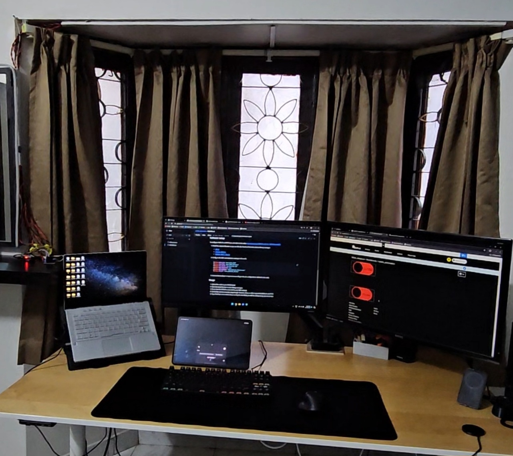
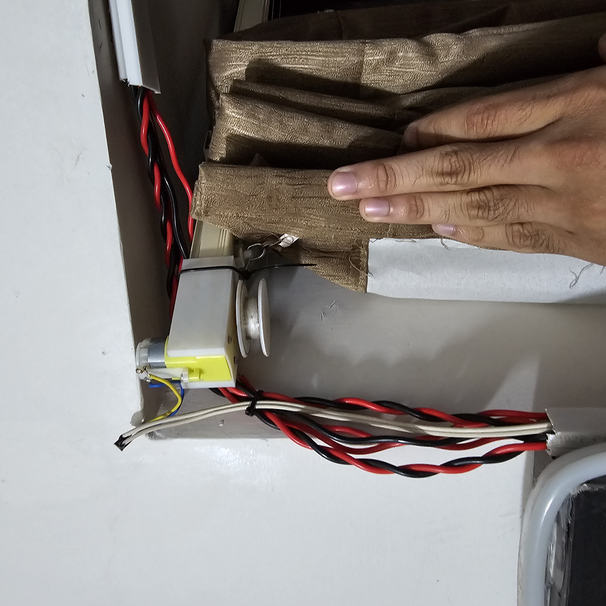
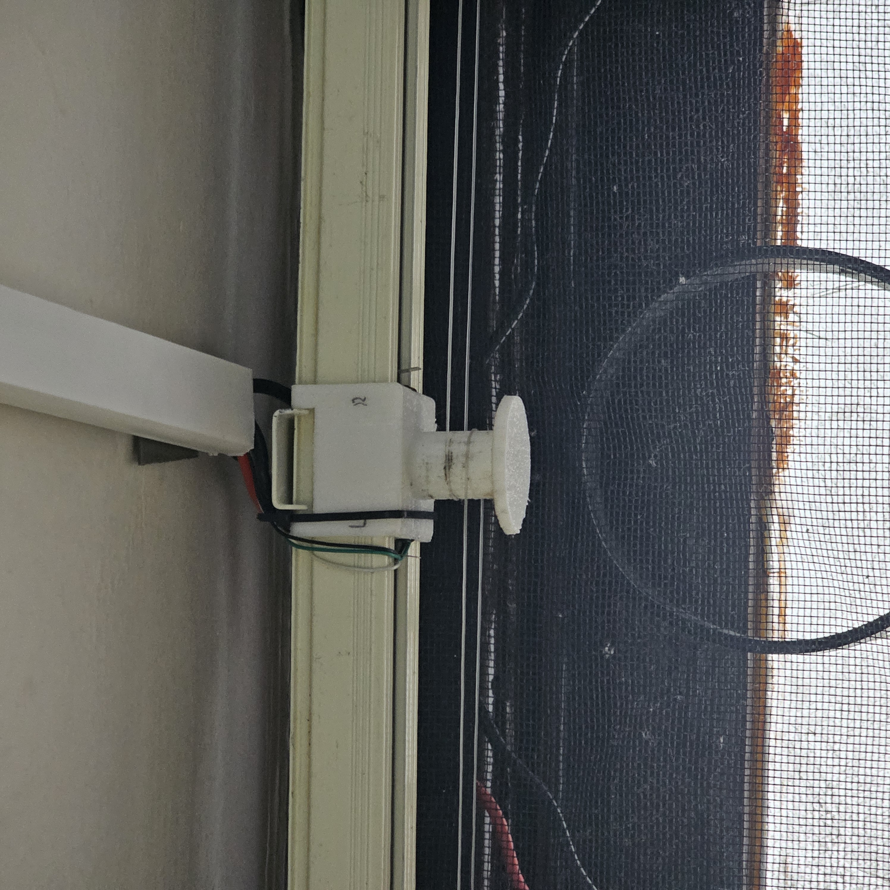
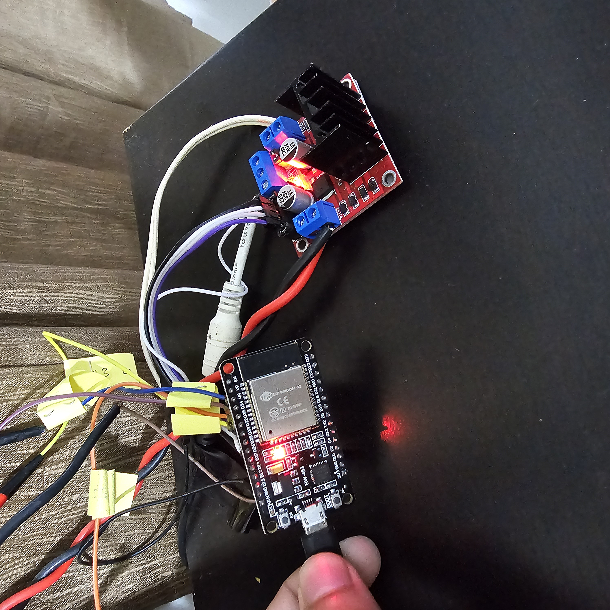

# ESP32 Automated Curtains Controller using FREERTOS


- Automated Curtains Controller is an ESP32-based project that allows you to control curtains automatically using Google Assistant, Alexa, or any platform supported by IFTTT. 
- The system utilizes limit switches and an L298N motor driver to automate the opening and closing of curtains making it a closed loop system.
- The best part is I was able to do all this at a cost of less than 800 Rupees or 10 Dollers
- Ive used FREERTOS to keep the wifi connected and at the same time to monitor the states of the curtains.

  
The code is designed specific to my curtains as I have 4 sererate curtains for 1 window which made the designing a little complex, however you can easily modify the code to make it run on a single curtain you just have to use 2 limit switches which is easily modifiable in the code.



- I had to design my own custom 3D printed mounts to hold the motors 



- And also I Had to design my own pully system to move the string



## Features

- Control curtains remotely using Google Assistant, Alexa, or other IFTTT-supported platforms.
- Automatic curtain movement based on limit switch inputs making it reliable as it is closed loop.
- MQTT connectivity for real-time communication and control, So you dont have to always give a command you can schedule it, or make it open and close based on the sunrise and sunset in google home.

## Hardware Requirements

- ESP32 development board
- L298N motor driver and generic dc geared motors 100 rpm would be enough, make sure it has enough torque though.
- Limit switches (left open, left close, right open, right close)
- Power supply depends on the amount of power your motor draws but 12 volts 2 amps should be enough for any generic motor
- Curtain mechanism (rails, rollers, etc.), for my specific case I had to 3D print my own parts as my curtains didnt have a pully already attached


## Software Setup
To configure Adafruit and IFTTT you can refer to this video:
https://youtu.be/xNAYrOiq-Rw?si=-rBiPlvHksep4d0Q

1. Install the required libraries or you can directly download from the arduino library manager:
   - [WiFi.h](https://github.com/espressif/arduino-esp32/blob/master/libraries/WiFi/src/WiFi.h)
   - [Adafruit_MQTT.h](https://github.com/adafruit/Adafruit_MQTT_Library/blob/master/Adafruit_MQTT.h)
   - [Adafruit_MQTT_Client.h](https://github.com/adafruit/Adafruit_MQTT_Library/blob/master/Adafruit_MQTT_Client.h)

2. Configure the WiFi and Adafruit.io settings in the code:
   ```cpp
   #define WLAN_SSID "Your_WiFi_SSID"
   #define WLAN_PASS "Your_WiFi_Password"
   #define AIO_SERVER "io.adafruit.com"
   #define AIO_SERVERPORT 1883
   #define AIO_USERNAME "Your_Adafruit_IO_Username"
   #define AIO_KEY "Your_Adafruit_IO_Key"
   ```

3. Connect the hardware components according to the pin configurations defined in the code.
   This is how I had to manage the cables, Things will change specific to your case.
   
 


## Usage

1. Upload the code to your ESP32 board you need to add the board to the arduino IDE, you can just search on the internet on how its done.
2. Open the Serial Monitor to view debug messages.
3. Ensure that the ESP32 is connected to your WiFi network.
4. Control the curtains remotely using Google Assistant, Alexa, or other supported platforms via IFTTT.
5. If you find that some curtains keep running its most likely you did the wiring wrong, just check that.

