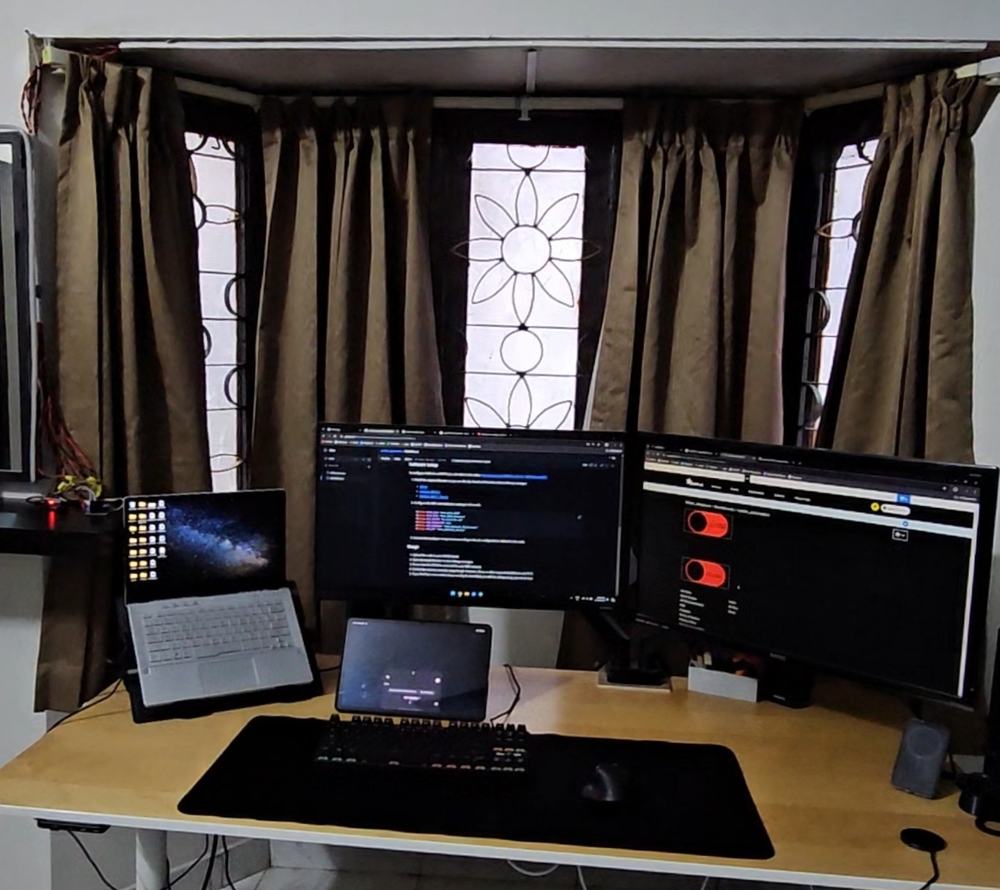

# ESP32 Curtain Controller

Connected curtain-control prototype using **ESP RainMaker** on ESP32. The Arduino sketch exposes a RainMaker switch, drives two curtain motors through four output pins, and reads four end-stop inputs.

[YouTube Video](https://www.youtube.com/watch?v=mknOZel5K7s)

## Current implementation

- RainMaker node `ESP32_Curtain` and switch `Curtain`.
- Power-state callback selects the opening or closing state.
- End-stop inputs stop the corresponding motor output.
- BLE provisioning with Wi-Fi credentials supplied through the provisioning flow.
- RainMaker OTA, time-zone service and scheduling enabled.
- A long press on the reset input invokes a factory reset.

The implementation is in [ESPcurtain.ino](ESPcurtain.ino). Earlier documentation described Adafruit MQTT and IFTTT; the current sketch uses RainMaker and contains no application-created FreeRTOS tasks.

## Wiring reference

| Signal in code | ESP32 GPIO |
| --- | --- |
| Motor `in1` / `in2` | 19 / 21 |
| Motor `in3` / `in4` | 22 / 23 |
| `lo` / `lc` end stops | 33 / 32 |
| `ro` / `rc` end stops | 35 / 34 |
| Reset button | 0 |

GPIO 34 and 35 are configured as `INPUT`; the hardware needs the appropriate external biasing. GPIO 32 and 33 use `INPUT_PULLUP`. Check switch polarity and physical endpoint mapping against the sketch rather than assuming the signal names describe the installed mechanism.

## Getting started

1. Use an ESP32 Arduino board package and board configuration that support ESP RainMaker and BLE provisioning.
2. Open `ESPcurtain.ino`, check the GPIO assignments and configure the provisioning service name and proof-of-possession value for your device.
3. Build and upload the sketch. Open the serial monitor at **115200 baud**.
4. Use the ESP RainMaker app to provision the device; the sketch prints provisioning information and a QR code.
5. Test the RainMaker switch and all four limit inputs with the motors disconnected, then verify each motor direction and stop position on the installed mechanism.

This repository does not pin a board-package version. Build and hardware compatibility must be checked for your board.

## Engineering scope

This prototype demonstrates cloud-connected actuation, callbacks, provisioning and limit-switch handling. The current code does not implement a motion timeout or obstruction detection. Motor-driver electrical details and mechanical installation must be validated on the physical build.

## Hardware photos

[Motor and mechanism](images/20240507_181029.jpg) · [Assembly](images/20240507_181036.jpg) · [Wiring](images/20240507_181038.jpg) · [Installed hardware](images/20240507_181050.jpg) · [Additional view](images/20240507_181054.jpg)
